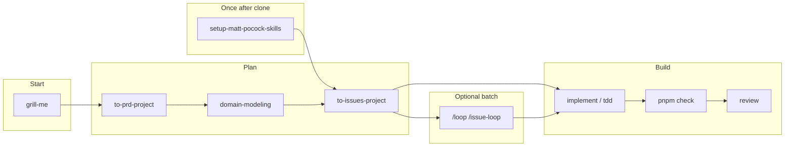

# Mandor Plate

Full-stack monorepo with NestJS API, Next.js dashboard, and agent-driven development workflow.

## Before you build

Start with **`grill-me`** (`/grilling`) to stress-test an idea, plan, or design — one question at a time — before writing a PRD or opening issues.

## Quickstart

```bash
pnpm install
cp apps/api/.env.example apps/api/.env
cp apps/web/.env.example apps/web/.env
pnpm docker:up
pnpm --filter @mandor-plate/api migration:run
pnpm --filter @mandor-plate/api seed:run
pnpm dev
```

| Service | URL                        |
| ------- | -------------------------- |
| API     | http://localhost:3001      |
| Web     | http://localhost:3000      |
| Swagger | http://localhost:3001/docs |
| Maildev | http://localhost:1080      |

Seeded accounts:

| Email                  | Password | Role  |
| ---------------------- | -------- | ----- |
| `admin@example.com`    | `secret` | admin |
| `john.doe@example.com` | `secret` | user  |

## Quality gates

```bash
pnpm check      # lint + typecheck + unit tests (before commit / PR)
pnpm lint
pnpm typecheck
pnpm test
```

Pre-commit runs lint-staged only. CI runs the full pipeline including E2E.

## E2E tests

Requires PostgreSQL and Maildev (via `pnpm docker:up`).

```bash
pnpm test:e2e:prepare   # build apps, migrate, seed
pnpm --filter @mandor-plate/web test:e2e:install   # first run only
pnpm test:e2e           # Playwright full-stack suite
```

Playwright specs live in [`apps/web/e2e/`](./apps/web/e2e/).

## Dev workflow

Planning docs are **not** committed — generate them with skills when needed. Read [CONTEXT.md](./CONTEXT.md) before coding.



| Step              | Skill / command            | Output                                        |
| ----------------- | -------------------------- | --------------------------------------------- |
| Sharpen the plan  | `grill-me`                 | Clear scope, trade-offs, and open questions   |
| Configure tracker | `setup-matt-pocock-skills` | GitHub Issues + triage labels (once per team) |
| Write PRD         | `to-prd-project`           | GitHub issue or `.scratch/<feature>/PRD.md`   |
| Domain terms      | `domain-modeling`          | Updates `CONTEXT.md`                          |
| Create tickets    | `to-issues-project`        | GitHub issues (`ready-for-agent`)             |
| Implement         | `implement`, `tdd`         | Code in monorepo                              |
| Quality gate      | `pnpm check`               | Lint + typecheck + unit tests                 |
| Review            | `review`                   | Standards + spec check                        |
| Batch work        | `/loop /issue-loop`        | Next open `ready-for-agent` issue             |

Core skills live in [`.agents/skills/`](./.agents/skills/) (committed — invoke directly in Cursor).

**Issue tracker:** GitHub Issues by default. Local drafts go to `.scratch/` (gitignored).

**Reference docs:** [CONTEXT.md](./CONTEXT.md) (vocabulary), [apps/web/README.md](./apps/web/README.md) (forms, themes, web conventions).

## Scripts

| Command                 | Description                      |
| ----------------------- | -------------------------------- |
| `pnpm dev`              | Start API + web (Turborepo)      |
| `pnpm check`            | Lint, typecheck, and unit tests  |
| `pnpm docker:up`        | Start PostgreSQL + Maildev       |
| `pnpm typecheck`        | TypeScript check all packages    |
| `pnpm test`             | Unit tests all packages          |
| `pnpm test:e2e`         | API + web E2E tests              |
| `pnpm test:e2e:prepare` | Build, migrate, and seed for E2E |

## Optional skills

Core set is already in `.agents/skills/`. Install extras when needed:

```bash
npx skills add mattpocock/skills@teach -y
npx skills add mattpocock/skills@prototype -y
npx skills add vercel-labs/agent-skills@web-design-guidelines -y
npx skills add anthropics/skills@frontend-design -y
```

See [mattpocock/skills](https://github.com/mattpocock/skills) and [vercel-labs/agent-skills](https://github.com/vercel-labs/agent-skills).
