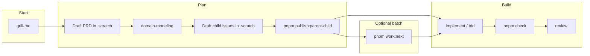

<div align="center">


# Mandor Plate

**Full-stack monorepo for shipping dashboards with AI agents at your side.**

NestJS API · Next.js dashboard · PostgreSQL · Turborepo · agent skills workflow

<br />

[](https://github.com/achmadya-dev/mandor-plate/actions/workflows/ci.yml)


<br />

[**Prerequisites**](#prerequisites) · [**Quickstart**](#quickstart) · [**Dev workflow**](#dev-workflow) · [**Scripts**](#scripts) · [CONTEXT.md](./CONTEXT.md) · [CLAUDE.md](./CLAUDE.md)

</div>

---

## Before you build

Start with **`grill-me`** to stress-test an idea, plan, or design — one question at a time — before writing a PRD or opening issues.

## Prerequisites

### Run the app

| Requirement          | Notes                                                         |
| -------------------- | ------------------------------------------------------------- |
| **Node.js** ≥ 20     | See `engines` in [package.json](./package.json)               |
| **pnpm** 10          | `corepack enable && corepack prepare pnpm@10.12.1 --activate` |
| **Docker** + Compose | PostgreSQL and Maildev via `pnpm docker:up`                   |

### Agent workflow

| Requirement               | Notes                                                                 |
| ------------------------- | --------------------------------------------------------------------- |
| **Agent runtime**         | Core skills ship in [`.agents/skills/`](./.agents/skills/)            |
| **GitHub CLI** (`gh`)     | Install and run `gh auth login`                                       |
| **Git remote** on GitHub  | Required to publish issues and run the parent/child workflow commands |
| **`.scratch/`** directory | Created automatically; gitignored — local PRD/issue drafts            |

The documented workflow uses the active skills shipped in this repo plus repo-level workflow commands. External skill packs are optional and not required.

Agent config (`docs/agents/`, `CLAUDE.md`) is pre-shipped — skip **`setup-matt-pocock-skills`** unless changing issue tracker or label vocabulary.

## Quickstart

```bash
pnpm install
cp apps/api/.env.example apps/api/.env
cp apps/web/.env.example apps/web/.env
pnpm docker:up
pnpm --filter @mandor-plate/api migration:run
pnpm --filter @mandor-plate/api seed:run
pnpm dev
```

<table width="100%">
<colgroup>
<col width="25%" />
<col width="75%" />
</colgroup>
<thead>
<tr><th>Service</th><th>URL</th></tr>
</thead>
<tbody>
<tr><td>API</td><td><a href="http://localhost:3001">localhost:3001</a></td></tr>
<tr><td>Web</td><td><a href="http://localhost:3000">localhost:3000</a></td></tr>
<tr><td>Swagger</td><td><a href="http://localhost:3001/docs">localhost:3001/docs</a></td></tr>
<tr><td>Maildev</td><td><a href="http://localhost:1080">localhost:1080</a></td></tr>
</tbody>
</table>

Seeded accounts:

<table width="100%">
<colgroup>
<col width="50%" />
<col width="25%" />
<col width="25%" />
</colgroup>
<thead>
<tr><th>Email</th><th>Password</th><th>Role</th></tr>
</thead>
<tbody>
<tr><td><code>admin@example.com</code></td><td><code>secret</code></td><td>admin</td></tr>
<tr><td><code>john.doe@example.com</code></td><td><code>secret</code></td><td>user</td></tr>
</tbody>
</table>

## Quality gates

```bash
pnpm check      # lint + typecheck + unit tests (before commit / PR)
pnpm lint
pnpm typecheck
pnpm test
```

Pre-commit runs lint-staged only. CI runs the full pipeline including E2E.

## E2E tests

Requires PostgreSQL and Maildev (via `pnpm docker:up`).

```bash
pnpm test:e2e:prepare   # build apps, migrate, seed
pnpm --filter @mandor-plate/web test:e2e:install   # first run only
pnpm test:e2e           # Playwright full-stack suite
```

Playwright specs live in [`apps/web/e2e/`](./apps/web/e2e/).

## Dev workflow

Planning docs are **not** committed — generate them with skills when needed. Read [CONTEXT.md](./CONTEXT.md) before coding.



<table width="100%">
<colgroup>
<col width="22%" />
<col width="28%" />
<col width="50%" />
</colgroup>
<thead>
<tr><th>Step</th><th>Skill / command</th><th>Output</th></tr>
</thead>
<tbody>
<tr><td>Sharpen the plan</td><td><code>grill-me</code></td><td>Scope, trade-offs, open questions</td></tr>
<tr><td>Write PRD</td><td>manual draft in <code>.scratch/</code></td><td><code>.scratch/&lt;feature&gt;/PRD.md</code></td></tr>
<tr><td>Domain terms</td><td><code>domain-modeling</code></td><td>Updates <code>CONTEXT.md</code></td></tr>
<tr><td>Create tickets</td><td>manual draft in <code>.scratch/</code></td><td><code>.scratch/…/issues/</code> (<code>Status: draft</code>)</td></tr>
<tr><td>Publish tickets</td><td><code>pnpm publish:parent-child</code></td><td>GitHub parent issue + native child sub-issues</td></tr>
<tr><td>Implement</td><td><code>implement</code>, <code>tdd</code></td><td>Code in monorepo</td></tr>
<tr><td>Quality gate</td><td><code>pnpm check</code></td><td>Lint, typecheck, unit tests</td></tr>
<tr><td>Review</td><td><code>review</code></td><td>Standards + spec check</td></tr>
<tr><td>Batch work</td><td><code>pnpm work:next</code></td><td>Next eligible standalone or parent-managed child issue</td></tr>
</tbody>
</table>

Core skills live in [`.agents/skills/`](./.agents/skills/) (committed — invoke by name, e.g. `grill-me`).

| Skill                      | Role                                       |
| -------------------------- | ------------------------------------------ |
| `grill-me`                 | Sharpen plan / scope                       |
| `domain-modeling`          | Update `CONTEXT.md` and ADR language       |
| `implement`                | Build a piece of work from a spec or issue |
| `tdd`                      | Test-driven development                    |
| `review`                   | Standards + spec review                    |
| `setup-matt-pocock-skills` | Configure issue tracker + labels (once)    |

**Agent setup:** This repo already ships with issue tracker, triage labels, and domain doc layout in [`docs/agents/`](./docs/agents/) and [`CLAUDE.md`](./CLAUDE.md). After clone, skip `setup-matt-pocock-skills` and go straight to planning skills. Re-run it only if you want to switch issue trackers or change triage label vocabulary.

**Issue tracker:** GitHub Issues — see [`docs/agents/issue-tracker.md`](./docs/agents/issue-tracker.md). **Create** in `.scratch/`; **publish** to GitHub with `pnpm publish:parent-child`.

**Reference docs:** [CONTEXT.md](./CONTEXT.md) (vocabulary), [apps/web/README.md](./apps/web/README.md) (forms, themes, web conventions).

**Example workflow:** [docs/examples/account-status-chip/](./docs/examples/account-status-chip/) — `grill-me` → draft `.scratch` PRD/issues → `domain-modeling` → `pnpm publish:parent-child` → `pnpm work:next`.

## Credits

Mandor Plate is built on these open-source projects:

<table width="100%">
<colgroup>
<col width="18%" />
<col width="32%" />
<col width="50%" />
</colgroup>
<thead>
<tr><th>Area</th><th>Source</th><th>Notes</th></tr>
</thead>
<tbody>
<tr><td>API</td><td><a href="https://github.com/brocoders/nestjs-boilerplate">brocoders/nestjs-boilerplate</a></td><td>NestJS REST API foundation (PostgreSQL only)</td></tr>
<tr><td>Web dashboard</td><td><a href="https://github.com/Kiranism/next-shadcn-dashboard-starter">next-shadcn-dashboard-starter</a></td><td>Dashboard shell, forms, and UI patterns</td></tr>
<tr><td>UI components</td><td><a href="https://ui.shadcn.com">shadcn/ui</a></td><td>Radix + Tailwind component primitives</td></tr>
<tr><td>Agent skills</td><td><a href="https://github.com/mattpocock/skills">mattpocock/skills</a></td><td>Core workflow skills shipped in <code>.agents/skills/</code></td></tr>
</tbody>
</table>

See also [apps/api/README.md](./apps/api/README.md) for API-specific upstream notes.

## Scripts

<table width="100%">
<colgroup>
<col width="38%" />
<col width="62%" />
</colgroup>
<thead>
<tr><th>Command</th><th>Description</th></tr>
</thead>
<tbody>
<tr><td><code>pnpm dev</code></td><td>Start API + web (Turborepo)</td></tr>
<tr><td><code>pnpm check</code></td><td>Lint, typecheck, and unit tests</td></tr>
<tr><td><code>pnpm docker:up</code></td><td>Start PostgreSQL + Maildev</td></tr>
<tr><td><code>pnpm typecheck</code></td><td>TypeScript check all packages</td></tr>
<tr><td><code>pnpm test</code></td><td>Unit tests all packages</td></tr>
<tr><td><code>pnpm test:e2e</code></td><td>API + web E2E tests</td></tr>
<tr><td><code>pnpm test:e2e:prepare</code></td><td>Build, migrate, and seed for E2E</td></tr>
<tr><td><code>pnpm publish:parent-child &lt;feature-slug&gt;</code></td><td>Publish one scratch PRD + child batch as a parent issue with native GitHub sub-issues</td></tr>
<tr><td><code>pnpm work:next [parent-issue-number]</code></td><td>Select the next eligible standalone or parent-managed child issue from GitHub</td></tr>
<tr><td><code>pnpm pr:open-parent &lt;parent-issue-number&gt; [base-branch]</code></td><td>Open the aggregate parent PR after required child issues are complete and no <code>hold-pr</code> gate remains</td></tr>
<tr><td><code>pnpm reconcile:parent-pr &lt;pr-number&gt;</code></td><td>Reconcile a merged parent PR back into parent and child issues</td></tr>
</tbody>
</table>

## Workflow skills

Core workflow skills are in `.agents/skills/`:

`grill-me`, `domain-modeling`, `implement`, `tdd`, `review`, `setup-matt-pocock-skills`, `to-prd`, `to-issues`, and related Matt Pocock skills.

The documented project workflow uses the skills committed in this repo plus the repo-level `pnpm` workflow commands above.
