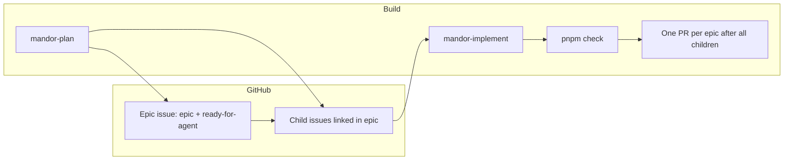

<div align="center">


# Mandor Plate

**Full-stack monorepo for shipping dashboards with AI agents at your side.**

NestJS API · Next.js dashboard · PostgreSQL · Turborepo · agent skills workflow

<br />

[](https://github.com/achmadya-dev/mandor-plate/actions/workflows/ci.yml)


<br />

[**Prerequisites**](#prerequisites) · [**Quickstart**](#quickstart) · [**Dev workflow**](#dev-workflow) · [**Scripts**](#scripts) · [CONTEXT.md](./CONTEXT.md) · [CLAUDE.md](./CLAUDE.md)

</div>

---

## Before you build

Start with **`mandor-plan`**. It can sharpen the scope, align terminology, and either keep planning local first or publish directly to GitHub.

## Prerequisites

### Run the app

| Requirement          | Notes                                                         |
| -------------------- | ------------------------------------------------------------- |
| **Node.js** ≥ 20     | See `engines` in [package.json](./package.json)               |
| **pnpm** 10          | `corepack enable && corepack prepare pnpm@10.12.1 --activate` |
| **Docker** + Compose | PostgreSQL and Maildev via `pnpm docker:up`                   |

### Agent workflow

| Requirement              | Notes                                                                        |
| ------------------------ | ---------------------------------------------------------------------------- |
| **Agent runtime**        | Core skills ship in [`.agents/skills/`](./.agents/skills/)                   |
| **GitHub CLI** (`gh`)    | Install and run `gh auth login`                                              |
| **Git remote** on GitHub | Required to read issues, push branches, and open PRs with `mandor-implement` |

The documented workflow uses the Mandor skills shipped in this repo. External skill packs are optional and not required.

Agent config (`docs/agents/`, `CLAUDE.md`) is pre-shipped and read directly by the remaining skills.

## Quickstart

```bash
pnpm install
cp apps/api/.env.example apps/api/.env
cp apps/web/.env.example apps/web/.env
pnpm docker:up
pnpm --filter @mandor-plate/api migration:run
pnpm --filter @mandor-plate/api seed:run
pnpm dev
```

<table width="100%">
<colgroup>
<col width="25%" />
<col width="75%" />
</colgroup>
<thead>
<tr><th>Service</th><th>URL</th></tr>
</thead>
<tbody>
<tr><td>API</td><td><a href="http://localhost:3001">localhost:3001</a></td></tr>
<tr><td>Web</td><td><a href="http://localhost:3000">localhost:3000</a></td></tr>
<tr><td>Swagger</td><td><a href="http://localhost:3001/docs">localhost:3001/docs</a></td></tr>
<tr><td>Maildev</td><td><a href="http://localhost:1080">localhost:1080</a></td></tr>
</tbody>
</table>

Seeded accounts:

<table width="100%">
<colgroup>
<col width="50%" />
<col width="25%" />
<col width="25%" />
</colgroup>
<thead>
<tr><th>Email</th><th>Password</th><th>Role</th></tr>
</thead>
<tbody>
<tr><td><code>admin@example.com</code></td><td><code>secret</code></td><td>admin</td></tr>
<tr><td><code>john.doe@example.com</code></td><td><code>secret</code></td><td>user</td></tr>
</tbody>
</table>

## Quality gates

```bash
pnpm check      # lint + typecheck + unit tests (before commit / PR)
pnpm lint
pnpm typecheck
pnpm test
```

Pre-commit runs lint-staged only. CI runs the full pipeline including E2E.

## E2E tests

Requires PostgreSQL and Maildev (via `pnpm docker:up`).

```bash
pnpm test:e2e:prepare   # build apps, migrate, seed
pnpm --filter @mandor-plate/web test:e2e:install   # first run only
pnpm test:e2e           # Playwright full-stack suite
```

Playwright specs live in [`apps/web/e2e/`](./apps/web/e2e/).

## Dev workflow

GitHub Issues are the source of truth. Read [CONTEXT.md](./CONTEXT.md) before coding.



<table width="100%">
<colgroup>
<col width="22%" />
<col width="28%" />
<col width="50%" />
</colgroup>
<thead>
<tr><th>Step</th><th>Skill / command</th><th>Output</th></tr>
</thead>
<tbody>
<tr><td>Plan feature</td><td><code>mandor-plan</code></td><td>Scope, terminology, local drafts or published epic + child issues</td></tr>
<tr><td>Implement epic</td><td><code>mandor-implement</code></td><td>One child issue per run; PR opens after all children</td></tr>
<tr><td>Quality gate</td><td><code>pnpm check</code></td><td>Lint, typecheck, unit tests</td></tr>
<tr><td>Review</td><td>GitHub review</td><td>Human review before merge</td></tr>
</tbody>
</table>

Core skills live in [`.agents/skills/`](./.agents/skills/) (committed — invoke by name, e.g. `mandor-implement`).

| Skill              | Role                                        |
| ------------------ | ------------------------------------------- |
| `mandor-plan`      | Plan locally or publish epic + child issues |
| `mandor-implement` | Implement GitHub epics and open PRs         |

**Agent config:** This repo already ships with issue tracker, triage labels, and domain doc layout in [`docs/agents/`](./docs/agents/) and [`CLAUDE.md`](./CLAUDE.md).

**Issue tracker:** GitHub Issues — see [`docs/agents/issue-tracker.md`](./docs/agents/issue-tracker.md). Create epic and child issues directly in GitHub for the automated loop.

**Reference docs:** [CONTEXT.md](./CONTEXT.md) (vocabulary), [apps/web/README.md](./apps/web/README.md) (forms, themes, web conventions).

**Example workflow:** use `mandor-plan` to prepare/publish an epic and child issues, then run `mandor-implement`.

## Credits

Mandor Plate is built on these open-source projects:

<table width="100%">
<colgroup>
<col width="18%" />
<col width="32%" />
<col width="50%" />
</colgroup>
<thead>
<tr><th>Area</th><th>Source</th><th>Notes</th></tr>
</thead>
<tbody>
<tr><td>API</td><td><a href="https://github.com/brocoders/nestjs-boilerplate">brocoders/nestjs-boilerplate</a></td><td>NestJS REST API foundation (PostgreSQL only)</td></tr>
<tr><td>Web dashboard</td><td><a href="https://github.com/Kiranism/next-shadcn-dashboard-starter">next-shadcn-dashboard-starter</a></td><td>Dashboard shell, forms, and UI patterns</td></tr>
<tr><td>UI components</td><td><a href="https://ui.shadcn.com">shadcn/ui</a></td><td>Radix + Tailwind component primitives</td></tr>
<tr><td>Agent skills</td><td><a href="https://github.com/mattpocock/skills">mattpocock/skills</a></td><td>Core workflow skills shipped in <code>.agents/skills/</code></td></tr>
</tbody>
</table>

See also [apps/api/README.md](./apps/api/README.md) for API-specific upstream notes.

## Scripts

<table width="100%">
<colgroup>
<col width="38%" />
<col width="62%" />
</colgroup>
<thead>
<tr><th>Command</th><th>Description</th></tr>
</thead>
<tbody>
<tr><td><code>pnpm dev</code></td><td>Start API + web (Turborepo)</td></tr>
<tr><td><code>pnpm check</code></td><td>Lint, typecheck, and unit tests</td></tr>
<tr><td><code>pnpm docker:up</code></td><td>Start PostgreSQL + Maildev</td></tr>
<tr><td><code>pnpm typecheck</code></td><td>TypeScript check all packages</td></tr>
<tr><td><code>pnpm test</code></td><td>Unit tests all packages</td></tr>
<tr><td><code>pnpm test:e2e</code></td><td>API + web E2E tests</td></tr>
<tr><td><code>pnpm test:e2e:prepare</code></td><td>Build, migrate, and seed for E2E</td></tr>
</tbody>
</table>

## Workflow skills

Workflow skills are in `.agents/skills/`:

`mandor-plan`, `mandor-implement`

The default automated workflow is GitHub-first: create an epic issue with child issue links, label the epic `epic` and `ready-for-agent`, then run `mandor-implement`. `mandor-plan` remains available when local planning is useful before publish.
