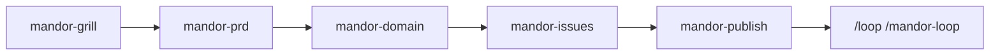

# Example: account-status-chip workflow

End-to-end sample for testing the Mandor Plate agent workflow: **skills → scratch → GitHub → loop**.

**Two modes:**

| Mode                         | When to use                                             |
| ---------------------------- | ------------------------------------------------------- |
| **A — Generate with skills** | Learn or re-run the full planning pipeline from an idea |
| **B — Use template**         | Skip planning; test publish + `/loop /mandor-loop` only |

Scratch files live under `.scratch/` (gitignored). The committed template is at `.scratch-template/`.

## Prerequisites

Before running this example:

| Requirement              | Verify                                                   |
| ------------------------ | -------------------------------------------------------- |
| Monorepo running locally | [Quickstart](../../../README.md#quickstart) — `pnpm dev` |
| `gh` authenticated       | `gh auth status`                                         |
| GitHub remote configured | `git remote -v`                                          |
| Core skills available    | `.agents/skills/` present (clone this repo)              |
| Scratch directory        | `mkdir -p .scratch`                                      |

For **Mode A**, invoke skills from Cursor. For **Mode B**, only publish + loop are needed.

---

## Mode A — Generate PRD & issues with skills

Invoke skills **in this order** (matches [README Dev workflow](../../../README.md#dev-workflow)):



| Step | Skill              | Invoke                         | Output                                     |
| ---- | ------------------ | ------------------------------ | ------------------------------------------ |
| 1    | **mandor-grill**   | `/mandor-grill` or `/grilling` | Sharpen scope (optional)                   |
| 2    | **mandor-prd**     | `mandor-prd`                   | `.scratch/account-status-chip/PRD.md`      |
| 3    | **mandor-domain**  | `mandor-domain`                | Updates `CONTEXT.md` if needed             |
| 4    | **mandor-issues**  | `mandor-issues`                | `.scratch/…/issues/*.md` (`Status: draft`) |
| 5    | **mandor-publish** | `mandor-publish`               | GitHub issues + `GitHub: #NN` in scratch   |
| 6    | **mandor-loop**    | `/loop /mandor-loop`           | Implement, commit, close each issue        |

### Example prompts

**Step 1 — mandor-grill** (optional):

```
/mandor-grill

I want to show account status (active/inactive) on the profile page and user nav.
Stress-test scope before we write a PRD.
```

**Step 2 — mandor-prd**:

```
mandor-prd

Feature: account-status-chip
Problem: users can't see account status in the dashboard UI.
Vertical slice: web only, reuse session user status — no new API.
Write PRD to .scratch/account-status-chip/PRD.md
```

**Step 3 — mandor-domain**:

```
mandor-domain

Review .scratch/account-status-chip/PRD.md — add any missing terms to CONTEXT.md
(e.g. account status vs role).
```

**Step 4 — mandor-issues** (create only — scratch):

```
mandor-issues

Break .scratch/account-status-chip/PRD.md into vertical slices.
Draft issues under .scratch/account-status-chip/issues/.
Set Status: ready-for-agent when criteria are complete. Do not publish.
```

**Step 5 — mandor-publish** (publish to GitHub):

```
mandor-publish

Publish all ready-for-agent issues under .scratch/account-status-chip/issues/
to GitHub with label ready-for-agent.
```

**Step 6 — mandor-loop**:

```
/loop /mandor-loop
```

Compare agent output to the reference template in `.scratch-template/` if helpful.

---

## Mode B — Copy template (skip generate)

Use when you only want to test **publish** and **loop**, not PRD/issue generation.

```bash
mkdir -p .scratch
cp -r docs/examples/account-status-chip/.scratch-template .scratch/account-status-chip
```

Then run **mandor-publish** (step 5) and **mandor-loop** (step 6). Issues are pre-filled with `Status: ready-for-agent`.

---

## Publish manually (or use mandor-publish)

Prefer the **mandor-publish** skill. Equivalent shell:

```bash
ISSUE=.scratch/account-status-chip/issues/01-shared-status-label.md
TITLE=$(sed -n '1s/^# //p' "$ISSUE")
gh issue create \
  --title "$TITLE" \
  --body "$(sed -n '/^## Summary/,$p' "$ISSUE")" \
  --label "ready-for-agent"
# Then edit the scratch file: GitHub: #NN
```

Repeat for `02-profile-status-badge.md` and `03-user-nav-status-chip.md`.

---

## Reference template contents

| File                                                  | Purpose                        |
| ----------------------------------------------------- | ------------------------------ |
| `.scratch-template/PRD.md`                            | Sample PRD (3 vertical slices) |
| `.scratch-template/issues/01-shared-status-label.md`  | Shared status label helper     |
| `.scratch-template/issues/02-profile-status-badge.md` | Profile page badge             |
| `.scratch-template/issues/03-user-nav-status-chip.md` | User nav chip                  |

## Feature summary

Show **account status** (`active` / `inactive`) as a colored badge on the profile page and in the user nav dropdown. Session user already includes `status`; this example adds consistent labeling and UI.

## Cleanup

```bash
rm -rf .scratch/account-status-chip
# Close/delete GitHub issues created during the test
```

## Related docs

- [Issue tracker (scratch-first)](../../agents/issue-tracker.md)
- [mandor-loop skill](../../../.agents/skills/mandor-loop/SKILL.md)
- [mandor-prd skill](../../../.agents/skills/mandor-prd/SKILL.md)
- [mandor-issues skill](../../../.agents/skills/mandor-issues/SKILL.md)
- [mandor-publish skill](../../../.agents/skills/mandor-publish/SKILL.md)
