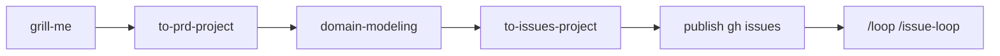

# Example: account-status-chip workflow

End-to-end sample for testing the Mandor Plate agent workflow: **skills → scratch → GitHub → loop**.

**Two modes:**

| Mode                         | When to use                                             |
| ---------------------------- | ------------------------------------------------------- |
| **A — Generate with skills** | Learn or re-run the full planning pipeline from an idea |
| **B — Use template**         | Skip planning; test publish + `/loop /issue-loop` only  |

Scratch files live under `.scratch/` (gitignored). The committed template is at `.scratch-template/`.

---

## Mode A — Generate PRD & issues with skills

Invoke skills **in this order** (matches [README Dev workflow](../../../README.md#dev-workflow)):



| Step | Skill                 | Invoke                     | Output                                       |
| ---- | --------------------- | -------------------------- | -------------------------------------------- |
| 1    | **grill-me**          | `/grill-me` or `/grilling` | Sharpen scope (optional but recommended)     |
| 2    | **to-prd-project**    | `to-prd-project`           | `.scratch/account-status-chip/PRD.md`        |
| 3    | **domain-modeling**   | `domain-modeling`          | Updates `CONTEXT.md` if new terms appear     |
| 4    | **to-issues-project** | `to-issues-project`        | `.scratch/account-status-chip/issues/*.md`   |
| 5    | Publish               | _(part of step 4)_         | `gh issue create` + `GitHub: #NN` in scratch |
| 6    | **issue-loop**        | `/loop /issue-loop`        | Implement, commit, close each issue          |

### Example prompts

**Step 1 — grill-me** (optional):

```
/grill-me

I want to show account status (active/inactive) on the profile page and user nav.
Stress-test scope before we write a PRD.
```

**Step 2 — to-prd-project**:

```
to-prd-project

Feature: account-status-chip
Problem: users can't see account status in the dashboard UI.
Vertical slice: web only, reuse session user status — no new API.
Write PRD to .scratch/account-status-chip/PRD.md
```

**Step 3 — domain-modeling**:

```
domain-modeling

Review .scratch/account-status-chip/PRD.md — add any missing terms to CONTEXT.md
(e.g. account status vs role).
```

**Step 4 — to-issues-project**:

```
to-issues-project

Break .scratch/account-status-chip/PRD.md into vertical slices.
Draft issues under .scratch/account-status-chip/issues/.
When I confirm, publish to GitHub with label ready-for-agent.
```

**Step 6 — issue-loop**:

```
/loop /issue-loop
```

Compare agent output to the reference template in `.scratch-template/` if helpful.

---

## Mode B — Copy template (skip generate)

Use when you only want to test **publish** and **loop**, not PRD/issue generation.

```bash
mkdir -p .scratch
cp -r docs/examples/account-status-chip/.scratch-template .scratch/account-status-chip
```

Then run steps **4–6** from Mode A (publish → loop). Issues are pre-filled with `Status: ready-for-agent`.

---

## Publish one issue (manual)

```bash
ISSUE=.scratch/account-status-chip/issues/01-shared-status-label.md
TITLE=$(sed -n '1s/^# //p' "$ISSUE")
gh issue create \
  --title "$TITLE" \
  --body "$(sed -n '/^## Summary/,$p' "$ISSUE")" \
  --label "ready-for-agent"
# Then edit the scratch file: GitHub: #NN
```

Repeat for `02-profile-status-badge.md` and `03-user-nav-status-chip.md`.

---

## Reference template contents

| File                                                  | Purpose                        |
| ----------------------------------------------------- | ------------------------------ |
| `.scratch-template/PRD.md`                            | Sample PRD (3 vertical slices) |
| `.scratch-template/issues/01-shared-status-label.md`  | Shared status label helper     |
| `.scratch-template/issues/02-profile-status-badge.md` | Profile page badge             |
| `.scratch-template/issues/03-user-nav-status-chip.md` | User nav chip                  |

## Feature summary

Show **account status** (`active` / `inactive`) as a colored badge on the profile page and in the user nav dropdown. Session user already includes `status`; this example adds consistent labeling and UI.

## Cleanup

```bash
rm -rf .scratch/account-status-chip
# Close/delete GitHub issues created during the test
```

## Related docs

- [Issue tracker (scratch-first)](../../agents/issue-tracker.md)
- [issue-loop skill](../../../.agents/skills/issue-loop/SKILL.md)
- [to-prd-project skill](../../../.agents/skills/to-prd-project/SKILL.md)
- [to-issues-project skill](../../../.agents/skills/to-issues-project/SKILL.md)
