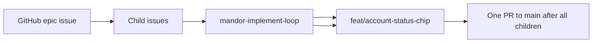

# Example: account-status-chip GitHub workflow

End-to-end sample for testing the Mandor Plate agent workflow: **GitHub epic → child issues → one child per run → one PR**.

## Prerequisites

Before running this example:

| Requirement              | Verify                                                   |
| ------------------------ | -------------------------------------------------------- |
| Monorepo running locally | [Quickstart](../../../README.md#quickstart) — `pnpm dev` |
| `gh` authenticated       | `gh auth status`                                         |
| GitHub remote configured | `git remote -v`                                          |
| Labels exist             | `epic`, `ready-for-agent`                                |
| Core skills available    | `.agents/skills/` present (clone this repo)              |

## Workflow



| Step | Surface                   | Output                                      |
| ---- | ------------------------- | ------------------------------------------- |
| 1    | GitHub child issues       | One commit-sized issue per vertical slice   |
| 2    | GitHub epic issue         | Links child issues                          |
| 3    | GitHub labels             | Epic has `epic` + `ready-for-agent`         |
| 4    | **mandor-implement-loop** | Implements one child issue per run          |
| 5    | GitHub PR                 | One epic PR opens after all child commits   |
| 6    | Human/admin review        | Merge PR after all children are implemented |

## Child Issues

Create the child issues first.

### Child 1 — Shared Status Label

```markdown
## Summary

Create a shared helper for rendering account status labels consistently.

## Acceptance criteria

- [ ] Active accounts render as `Active`
- [ ] Inactive accounts render as `Inactive`
- [ ] Helper is reusable from profile and user nav surfaces
```

### Child 2 — Profile Status Badge

```markdown
## Summary

Show the current user's account status on the profile page.

## Acceptance criteria

- [ ] Profile page displays the session user's status
- [ ] Badge uses the shared status label helper
- [ ] Empty or unknown status falls back safely
```

### Child 3 — User Nav Status Chip

```markdown
## Summary

Show the current user's account status in the user navigation dropdown.

## Acceptance criteria

- [ ] User nav displays the session user's status
- [ ] Chip uses the shared status label helper
- [ ] Layout remains stable in the compact nav menu
```

## Epic Issue

Create an epic issue after the child issues exist. Replace the issue numbers below with the real child issue numbers.

Apply labels: `epic`, `ready-for-agent`.

```markdown
## Summary

Show account status (`active` / `inactive`) as a consistent UI signal on the profile page and in the user nav dropdown. Session user already includes `status`; this feature should reuse that existing data.

## Implementation issues

- #101
- #102
- #103

## Acceptance

- [ ] Each linked child issue is implemented
- [ ] One branch is created for this epic
- [ ] One atomic commit exists per child issue
- [ ] One PR is opened to `main`
- [ ] `pnpm check` passes
```

## Run

Invoke:

```text
mandor-implement-loop
```

In cron mode, the VPS job checks for open issues with labels `epic` and `ready-for-agent`, then invokes **mandor-implement-loop**. Each run implements the next unimplemented child issue and pushes it to the same epic branch. The PR is opened only after all child issues are implemented.

Expected result:

- Branch: `feat/account-status-chip`
- Commits:
  - `feat(...): #101 — shared status label`
  - `feat(...): #102 — profile status badge`
  - `feat(...): #103 — user nav status chip`
- PR body:
  - `Refs #<epic>`
  - `Closes #101`
  - `Closes #102`
  - `Closes #103`

The agent must not merge the PR. The child issues close through the PR body when the epic PR merges. When all child issues are implemented, the agent removes `ready-for-agent`, adds `ready-for-human`, and leaves the epic open for human review until the PR is merged.

## Related Docs

- [Issue tracker](../../agents/issue-tracker.md)
- [mandor-implement-loop skill](../../../.agents/skills/mandor-implement-loop/SKILL.md)
